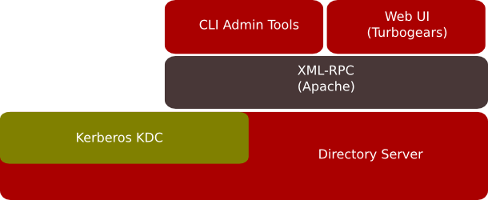

<style>
section {
  font-size: 28px;
  padding: 75px 64px 92px 64px;
}

:root {
  --preview-base: #4f6672;
}

header {
  position: absolute !important;
  top: 14px !important;
  right: 20px !important;
  left: auto !important;
  width: auto !important;
  padding: 0 !important;
  font-size: 0;
  line-height: 0;
  border: none;
  background: transparent;
  z-index: 10;
}
header img {
  width: 85px;
  height: auto;
  display: block;
  opacity: 0.88;
}

section.theme-gradient-motif {
  background-color: var(--preview-base);
  background-image:
    linear-gradient(to bottom,
      rgba(255, 255, 255, 0.12) 0%,
      rgba(255, 255, 255, 0.04) 12%,
      rgba(0, 0, 0, 0) 32%,
      rgba(0, 0, 0, 0) 68%,
      rgba(0, 0, 0, 0.05) 88%,
      rgba(0, 0, 0, 0.12) 100%
    );
  position: relative;
  overflow: hidden;
}

section.theme-gradient-motif::before {
  content: "";
  position: absolute;
  inset: 0;
  pointer-events: none;
  opacity: 0.28;
  background-repeat: no-repeat;
  background-image:
    radial-gradient(circle, rgba(225, 238, 255, 0.95) 0 2px, transparent 3px),
    radial-gradient(circle, rgba(225, 238, 255, 0.95) 0 2px, transparent 3px),
    radial-gradient(circle, rgba(225, 238, 255, 0.95) 0 2px, transparent 3px),
    radial-gradient(circle, rgba(225, 238, 255, 0.95) 0 2px, transparent 3px),
    radial-gradient(circle, rgba(225, 238, 255, 0.95) 0 2px, transparent 3px),
    radial-gradient(circle, rgba(225, 238, 255, 0.95) 0 2px, transparent 3px),
    linear-gradient(rgba(225, 238, 255, 0.72), rgba(225, 238, 255, 0.72)),
    linear-gradient(rgba(225, 238, 255, 0.72), rgba(225, 238, 255, 0.72)),
    linear-gradient(rgba(225, 238, 255, 0.72), rgba(225, 238, 255, 0.72)),
    linear-gradient(rgba(225, 238, 255, 0.72), rgba(225, 238, 255, 0.72));
  background-size:
    6px 6px, 6px 6px, 6px 6px, 6px 6px, 6px 6px, 6px 6px,
    110px 1px, 70px 1px, 110px 1px, 70px 1px;
  background-position:
    7% 82%, 14% 76%, 22% 82%, 78% 18%, 86% 24%, 93% 18%,
    7.8% 81.7%, 14.5% 76.2%, 78.7% 18.2%, 86.5% 24.2%;
}

section.theme-gradient-motif > :not(header):not(footer):not(.footnote) {
  position: relative;
  z-index: 1;
}
section p {
  position: static !important;
}

section.theme-gradient-motif h1,
section.theme-gradient-motif h2,
section.theme-gradient-motif h3,
section.theme-gradient-motif p,
section.theme-gradient-motif li,
section.theme-gradient-motif strong,
section.theme-gradient-motif em {
  color: #f4f8ff;
}
h1 {
  font-size: 1.8em;
}
h2 {
  font-size: 1.3em;
  margin: 0 0 0.75em 0;
  padding-bottom: 0.12em;
  border-bottom: 2px solid rgba(255, 255, 255, 0.3);
}
li {
  font-size: 0.95em;
}
pre {
  background: rgba(0, 0, 0, 0.32);
  padding: 0.45em 0.6em;
  border-radius: 8px;
}
pre code {
  color: #ffffff !important;
}
section img {
  display: block;
  margin: 0.4em auto;
  max-width: 90%;
  max-height: 70vh;
  width: auto;
  height: auto;
  object-fit: contain;
}
section.fit-image {
  display: grid;
  grid-template-rows: auto minmax(0, 1fr);
  align-items: stretch;
}
section.fit-image > p {
  margin: 0;
  height: 100%;
  min-height: 0;
  display: flex;
  align-items: center;
  justify-content: center;
  overflow: hidden;
}
section.fit-image img {
  max-width: 100%;
  max-height: 100%;
  width: auto;
  height: auto;
  object-fit: contain;
}
.two-col-layout {
  display: grid;
  grid-template-columns: 48% 50%;
  gap: 2%;
  align-items: start;
  margin-top: 0.4em;
}
section.two-col {
  display: block;
}
.footnote {
  position: absolute;
  left: 40px;
  right: 40px;
  bottom: 54px;
  font-size: 0.45em;
  opacity: 0.85;
  z-index: 3;
}
section:has(.footnote) {
  padding-bottom: 132px;
}
section.section-divider {
  display: flex;
  align-items: center;
  justify-content: center;
  text-align: center;
}
section.section-divider h1 {
  margin: 0;
  border-bottom: 0;
  font-size: 2.6em;
}
table {
  width: 100%;
  border-collapse: separate;
  border-spacing: 0.3em 0.3em;
  font-size: 0.82em;
}
th {
  background: rgba(255, 255, 255, 0.15);
  padding: 0.4em 0.6em;
  text-align: left;
}
td {
  padding: 0.35em 0.6em;
  background: rgba(0, 0, 0, 0.2);
}
</style>

<!-- _paginate: false -->
<!-- _header: "" -->
<!-- _class: lead invert -->
<style scoped>
section {
  background-image:
    linear-gradient(to bottom, rgba(0, 0, 0, 0.72), rgba(0, 0, 0, 0.82)),
    url(images/intlug-banner.png);
  background-size: cover;
  background-position: center;
}
h1 { color: #FFD700; text-shadow: 2px 2px 4px rgba(0,0,0,0.9); }
h2 { color: #FFFF00; text-shadow: 2px 2px 4px rgba(0,0,0,0.9); }
h3 { color: #FFFFFF; text-shadow: 1px 1px 3px rgba(0,0,0,0.9); font-size: 1.2em; margin-top: 0.2em; }
p, li, em, strong { color: #FFFFFF; text-shadow: 1px 1px 3px rgba(0,0,0,0.9); }
a { color: #00FFFF; }
</style>

# Welcome to INTLUG!
## International Linux Users Group

**June 2026**

We meet every first Saturday of the month
### **10AM EST**

Join us:
- Events: https://heylo.group/international-linux-users-group
- Mailing list: https://lists.firemountain.net/mailman/listinfo/intlug

---

<!-- _paginate: false -->
<!-- _header: "" -->
<!-- _class: lead invert -->


# FreeIPA

### Identity · Policy · Audit

---

## Agenda

1. The problem with Linux auth today
2. What is FreeIPA?
3. Architecture overview
4. Key capabilities — users, sudo, HBAC, PKI, DNS
5. FreeIPA vs Active Directory
6. Who needs this?
7. Installing the server
8. Enrolling clients
9. Demo
10. Honorable mentions

---

<!-- _class: section-divider invert theme-gradient-motif -->

# The Problem

---

## Linux Auth Without FreeIPA

Each machine manages its own identity:

- `/etc/passwd` and `/etc/shadow` per host — no sharing
- Adding a user means logging into **every machine** and running `useradd`
- `/etc/sudoers` managed per host — configuration drift guaranteed
- SSH public keys scattered across `~/.ssh/authorized_keys` on every server
- No central host or service inventory

The result: ten machines means ten places to make the same change — and forget one.

---

## The Gaps That Bite You

Beyond just users:

- **No PKI** — self-signed certs everywhere, manual renewals, no lifecycle
- **No DNS security** — no DNSSEC, no authoritative internal DNS tied to identity
- **No access auditing** — who logged into what, when?
- **No host-based access control** — either everyone with a password can log in, or you manage it by hand per host
- **No offline credential caching** — laptop on a plane can't authenticate

This is manageable at two servers. It doesn't scale.

---

<!-- _class: section-divider invert theme-gradient-motif -->

# What is FreeIPA?

---

## FreeIPA: The Easy Button

**Identity, Policy, and Audit** — integrated and open source.

- One place to manage **users, groups, hosts, and services**
- One `ipa-client-install` command to join any Linux machine
- Kerberos SSO: log in once, access everything you're permitted to
- Built-in CA for certificate issuance and auto-renewal
- Integrated DNS with DNSSEC

FreeIPA doesn't replace your tools — it ties them together under a single management plane.

---

## The Open Source Stack

FreeIPA assembles proven upstream projects:

| Component | Project | Role |
|-----------|---------|------|
| `dirsrv` | 389 Directory Server | LDAP directory backend |
| `krb5kdc` | MIT Kerberos 5 | Authentication / SSO |
| Dogtag + certmonger | Dogtag PKI | Certificate authority |
| `named` | BIND + PKCS#11 | DNS and DNSSEC |
| `httpd` | Apache | Web UI and JSON-RPC API |
| `sssd` | SSSD | Client-side identity daemon |

None of these are new — FreeIPA makes them work together out of the box.

---

<!-- _class: section-divider invert theme-gradient-motif -->

# Architecture

---

<!-- _class: fit-image invert theme-gradient-motif -->

## Architecture Overview



---

## dirsrv — 389 Directory Server

The LDAP backbone of FreeIPA.

- Stores all objects: users, groups, hosts, services, policies, DNS records
- Port 389 (LDAP) and 636 (LDAPS) — that's where the name "389" comes from
- Descends from Netscape Directory Server → open-sourced by Red Hat as Fedora DS → 389 DS
- FreeIPA extends the schema with its own object classes
- Replication is handled here — multiple FreeIPA servers share a replicated DIT

All `ipa` CLI commands and the web UI are ultimately reads/writes against `dirsrv`.

---

## Kerberos — MIT Kerberos 5

The authentication layer.

- Issues **tickets** (TGT and service tickets) — no passwords sent over the wire after initial login
- `kinit` to get a ticket, `klist` to see what you have, `kdestroy` to clear them
- Enables true SSO: one `kinit` and you can SSH, access the web UI, mount NFS, hit LDAP — all without re-entering a password
- FreeIPA maps Kerberos principals to LDAP entries — one unified identity

The Kerberos realm (e.g. `EXAMPLE.COM`) maps directly to your FreeIPA domain.

---

## Dogtag & certmonger — PKI

Two components working together:

**Dogtag** (on the FreeIPA server)
- Full-featured Certificate Authority
- Issues, renews, and revokes X.509 certificates
- CRL and OCSP support

**certmonger** (on clients and server)
- Tracks certificate expiry
- Automatically requests renewal before expiry
- Works with Dogtag over DBUS — clients don't need to know CA details

Your entire infrastructure can have valid, auto-renewing certificates from your own CA.

---

## BIND — DNS and DNSSEC

FreeIPA integrates BIND with two important additions:

- **LDAP-backed zone data** — DNS records stored in `dirsrv`, automatically updated when hosts enroll or are added via `ipa`
- **`named-pkcs11`** — a PKCS#11-enabled build of BIND that stores DNSSEC signing keys in NSS, enabling DNSSEC without exposing raw key files

When a client enrolls, its A and PTR records are created automatically. When it's removed, they're cleaned up.

---

## Apache & ipa-httpd — Web UI and API

The management interface layer:

- **Web UI** — full-featured browser interface at `https://ipa.example.com/ipa/ui/`
- **JSON-RPC API** — every `ipa` CLI command is an API call; the same API is available for scripting and automation
- **SPNEGO / Kerberos HTTP auth** — with a valid Kerberos ticket, the web UI logs you in automatically (no password prompt)
- **Dogtag proxy** — certificate operations route through here

The `ipa` CLI is essentially a JSON-RPC client — everything it can do, you can do via the API.

---

## SSSD — The Client Daemon

On every enrolled Linux client, SSSD is the bridge between the OS and FreeIPA:

- Handles `getpwnam`, `getgrnam`, `pam_authenticate` — transparent to applications
- **Caches** user and credential data — authentication works offline (e.g. laptop on a plane)
- Enforces **HBAC rules** locally — access denied before a session is even established
- Maps Kerberos principals to local UIDs/GIDs
- Configured automatically by `ipa-client-install`

SSSD is what makes FreeIPA invisible to the rest of the system.

---

<!-- _class: section-divider invert theme-gradient-motif -->

# Key Capabilities

---

## Users, Groups, Sudo Rules, and HBAC

The day-to-day management layer:

**Users & Groups**
- `ipa user-add jsmith --first=Jane --last=Smith`
- Store SSH public keys, SSH fingerprints auto-published via DNS (SSHFP records)

**Sudo Rules** — centrally define who can run what, on which hosts
- `ipa sudorule-add allow-admins --hostcat=all --cmdcat=all`

**HBAC — Host-Based Access Control** — who can log into which service on which host
- Default deny: unless a rule permits it, the user can't log in
- More granular than sudo — controls `sshd`, `vsftpd`, `httpd` independently

---

## Certificate Management

From chaos to lifecycle-managed PKI:

- Request a cert: `getcert request -k /etc/pki/tls/private/myservice.key -f /etc/pki/tls/certs/myservice.crt -K HTTP/myhost.example.com`
- certmonger tracks it, renews it automatically before expiry
- All internal services can have **valid certificates from your own CA**
- CA cert distributable to browsers and OS trust stores via the FreeIPA CA bundle

Use cases: internal HTTPS, LDAPS, service-to-service mTLS, VPN certificates.

---

## DNS and DNSSEC

FreeIPA as the authoritative DNS for your internal domain:

- Records created automatically on client enrollment
- Manage via `ipa dnsrecord-add`, `ipa dnszone-add`, or the web UI
- Forward zones for external resolution
- **DNSSEC** — your internal domain can be signed, protecting against cache poisoning and spoofing

For home labs: FreeIPA becomes your `example.home` authoritative nameserver — no more `/etc/hosts` maintenance.

---

<!-- _class: section-divider invert theme-gradient-motif -->

# FreeIPA vs Active Directory

---

## FreeIPA and Active Directory

They share a lineage (Kerberos + LDAP) but differ in focus:

| Feature | FreeIPA | Active Directory |
|---------|---------|-----------------|
| Platform | Linux-native | Windows-native |
| Auth protocol | Kerberos 5 / LDAP | Kerberos 5 / LDAP |
| DNS | Integrated BIND | Integrated |
| PKI | Dogtag CA | Microsoft CA |
| Access control | HBAC + Sudo rules | GPO |
| Web UI | Yes | ADAC / RSAT |
| Cross-domain trust | Yes (AD trust) | Forest trust |
| License | Open source | Proprietary |

For Linux-heavy environments, FreeIPA is the natural fit. They can coexist via trust.

---

<!-- _class: section-divider invert theme-gradient-motif -->

# Who Needs This?

---

## Home Lab Users

You don't need 500 servers to benefit:

- **One user account** — log into any VM or container with the same credentials
- **SSH keys stored once** — `ipa user-mod jsmith --sshpubkey="ssh-ed25519 ..."` and it works everywhere
- **Sudo managed centrally** — no more editing `/etc/sudoers` on each machine
- **Internal CA** — valid HTTPS for Home Assistant, Grafana, Proxmox, Gitea — no browser warnings
- **DNS for your home domain** — `*.home.lab` resolves correctly on all your devices
- **DNSSEC** — because why not

If you run more than two Linux machines at home, FreeIPA pays off.

---

## Enterprise Users

At scale, this is where FreeIPA shines:

- **Compliance** — HBAC and sudo rules create an auditable access control layer (PCI-DSS, SOX, HIPAA, CIS)
- **Least-privilege enforcement** — who can SSH to a production DB host? Define it once, enforce it everywhere
- **Certificate lifecycle** — hundreds of service certs, all auto-renewing, no surprises at 2AM
- **Onboarding / offboarding** — add or disable a user in one place; access across all systems follows immediately
- **AD integration** — existing Windows AD? FreeIPA can trust it — Linux systems get the benefit of FreeIPA while AD users can authenticate too

---

<!-- _class: section-divider invert theme-gradient-motif -->

# Getting Started

---

## Installing freeipa-server

Requires a dedicated hostname with forward and reverse DNS resolving correctly before you start.

```bash
dnf install freeipa-server freeipa-server-dns

ipa-server-install \
  --domain=example.com \
  --realm=EXAMPLE.COM \
  --ds-password=<directory-manager-password> \
  --admin-password=<admin-password> \
  --setup-dns \
  --no-forwarders
```

The installer configures `dirsrv`, `krb5kdc`, `named`, `httpd`, `certmonger`, and `firewalld` rules automatically.

<div class="footnote">Supported on Fedora, RHEL, CentOS Stream, Rocky Linux, AlmaLinux</div>

---

## After Server Install

Verify everything is running:

```bash
ipactl status

# Expected output:
# Directory Service: RUNNING
# krb5kdc Service: RUNNING
# kadmin Service: RUNNING
# named Service: RUNNING
# httpd Service: RUNNING
# ipa-custodia Service: RUNNING
# ntpd Service: RUNNING
# pki-tomcatd Service: RUNNING
# ipa-otpd Service: RUNNING
```

Web UI is available at `https://ipa.example.com/ipa/ui/`

Authenticate: `kinit admin`

---

## Enrolling Clients

One command to join a Linux machine to FreeIPA:

```bash
dnf install freeipa-client

ipa-client-install \
  --domain=example.com \
  --server=ipa.example.com \
  --principal=admin \
  --password=<admin-password>
```

What this does automatically:
- Configures SSSD for identity and authentication
- Sets up Kerberos (`/etc/krb5.conf`)
- Registers the host in FreeIPA and creates DNS records
- Configures PAM and NSS to use SSSD
- Requests a host certificate from Dogtag

---

## After Client Enrollment

```bash
# On the client — verify the host is enrolled
ipa-client-install --unattended --no-ntp  # (already done)

# Test that user resolution works
id jsmith
# uid=1234(jsmith) gid=1234(jsmith) groups=1234(jsmith),1000(admins)

# Get a Kerberos ticket and SSH without a password
kinit jsmith
ssh jsmith@otherhost.example.com
klist
```

HBAC rules control whether `jsmith` can actually log in. Default policy: admins only until you create rules.

---

<!-- _class: section-divider invert theme-gradient-motif -->

# Demo

---

## Demo

Walk-through of a working FreeIPA environment:

1. Web UI tour — Users, Groups, Hosts, HBAC, Sudo rules
2. Create a new user via `ipa user-add`
3. Create an HBAC rule allowing the user onto a specific host
4. Create a sudo rule for the user
5. Login to the client host as the new user
6. Run `klist` — show the Kerberos ticket
7. Verify `sudo` works per the rule
8. Request a service certificate with `getcert request`

---

<!-- _class: section-divider invert theme-gradient-motif -->

# Honorable Mentions

---

## AD Trust Integration

FreeIPA and Active Directory can coexist via a cross-realm trust:

```bash
# On the FreeIPA server — install trust components
ipa-adtrust-install --netbios-name=IPA

# Establish the trust
ipa trust-add --type=ad ad.example.com \
  --admin Administrator \
  --password
```

Once trusted:
- AD users can authenticate to Linux systems via FreeIPA
- FreeIPA HBAC and sudo rules apply to AD users
- No need to migrate AD accounts — they work as-is through the trust

Useful when Linux and Windows infrastructure coexist in the same organisation.

---

<!-- _paginate: false -->
<!-- _header: "" -->
<!-- _class: lead invert theme-gradient-motif -->

## Questions?

---

<!-- _paginate: false -->
<!-- _header: "" -->
<!-- _class: lead invert -->
<style scoped>
section {
  background-image:
    linear-gradient(to bottom, rgba(0, 0, 0, 0.72), rgba(0, 0, 0, 0.82)),
    url(images/intlug-banner.png);
  background-size: cover;
  background-position: center;
}
h1 { color: #FFD700; text-shadow: 2px 2px 4px rgba(0,0,0,0.9); }
h2 { color: #FFFF00; text-shadow: 2px 2px 4px rgba(0,0,0,0.9); }
p, li, em, strong { color: #FFFFFF; text-shadow: 1px 1px 3px rgba(0,0,0,0.9); }
a { color: #00FFFF; }
</style>

# Thank You!
## Next Meeting — July 2026

We meet every first Saturday of the month — **10AM EST**

- Events: https://heylo.group/international-linux-users-group
- Mailing list: https://lists.firemountain.net/mailman/listinfo/intlug
- These slides: https://github.com/intlug/freeipa.git

Resources:
- https://www.freeipa.org
- https://pagure.io/freeipa
